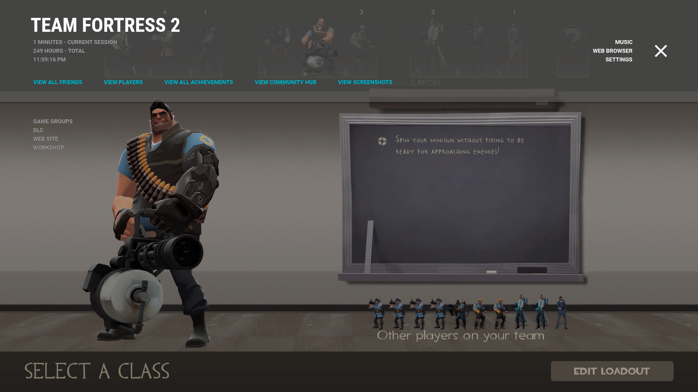

# Air for Steam / An elegant and customizable skin for Steam

Air is a visual redesign of the Steam client that embraces Google's Material Design language to showcase consistent beauty through minimal design.

This is an archive of the final official release of Air. Thanks for all your support!
<3

